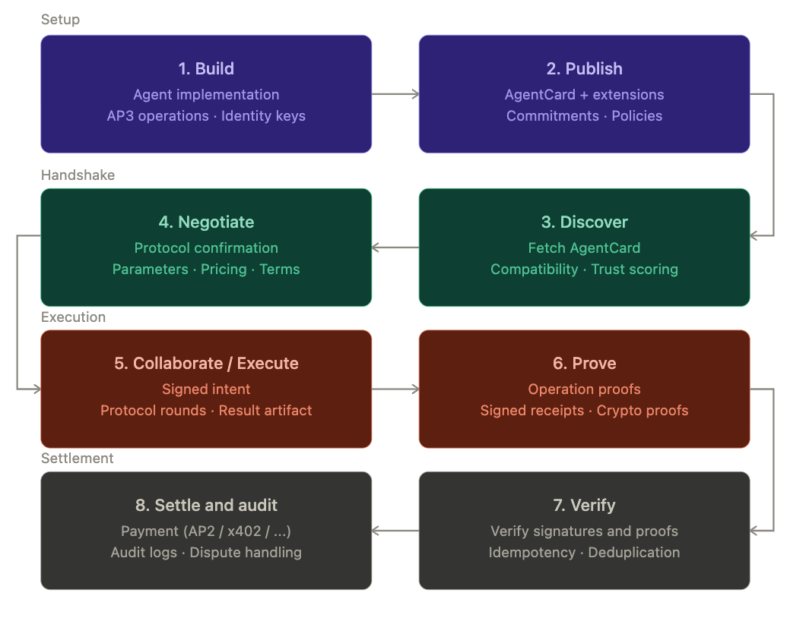

---
hide:
    - toc
---

<!-- markdownlint-disable MD041 -->
<h1><strong>The Agentic Stack</strong></h1>

AP3 is a **privacy + integrity layer** inside a broader “agentic stack” that enables agents from different orgs to safely **discover**, **negotiate**, and **collaborate**—and eventually do so as part of real **commerce** (payment/settlement) with **auditability**.

This document outlines a pragmatic engineering view of how that stack can evolve, staged by lifecycle phases and the concrete artifacts you would expect to exist at each stage.

### Who this page is for

If you've already read [Architecture](architecture.md) and the core concepts (Roles, Commitments, Operations, Directives, Private APIs), this page zooms out one level. It's the **lifecycle view**: where AP3 fits among neighboring concerns like identity, negotiation, settlement, and audit, and what each stage of that lifecycle looks like in engineering terms — what you build, what you publish, what you check, and what you sign.

You don't need to implement every stage on day one. Most teams start at *Build → Publish → Discovery → Execute* and grow into negotiation, proofs, and settlement as the use case matures.

---

### Big picture

{width="80%"}
{style="text-align: center; margin-bottom:1em; margin-top:1em;"}

---

### Stage 1: Build (what you ship)

Engineering components that need to exist locally:

- **Agent runtime**: framework adapter (ADK/CrewAI/LangGraph/etc.), tool routing, message ingestion.
- **AP3 integration**:
    - middleware/executor that keeps protocol traffic in **structured data** (e.g., A2A `Part.data`)
    - operation implementations (e.g., PSI), state handling, bounds checking.
- **Identity**:
    - long-lived **signing keys** (per agent identity, not per process)
    - rotation strategy (publish-next-key, overlap window, revocation).
- **Policy controls**:
    - inbound/outbound allowlists, request size bounds, rate limits, per-peer quotas.
    - consent + provenance rules (what inputs are allowed to be used in private compute).

Deliverables:

- A stable *runtime boundary* between **LLM reasoning** and **protocol execution**.
- A stable *crypto boundary* between **identity keys** and **protocol/session keys**.

---

### Stage 2: Publish (what you advertise)

Public artifacts a peer needs to interact safely:

- **AgentCard** with:
    - supported AP3 roles and operation types
    - AP3 public keys (and rotation metadata)
    - commitments (metadata + signatures)
    - URLs / interfaces / transport bindings.
- **Commitments** (signed):
    - what dataset shape you are willing to compute against (structure/format/count/freshness)
    - *optionally* a data hash or schema hash (future: proofs, membership commitments, etc.).
- **Operational policies**:
    - limits (payload sizes, TTLs), SLAs, pricing signals (if commerce), and audit expectations.

AP3 today: commitment signatures and canonical directive signing are foundational “publish” mechanics.

---

### Stage 3: Discovery (who can I work with?)

Discovery is where ecosystems usually break unless engineered carefully.

What implementations should do:

- **Fetch + cache AgentCards** with TTL and key-rotation awareness.
- **Compatibility evaluation**:
    - operation match (e.g. PSI) and version match (operation_id)
    - parameter compatibility (data shape constraints, operation limits)
    - policy compatibility (allowed peers, jurisdictions, freshness expectations).
- **Trust evaluation**:
    - verify card signatures / key provenance (future)
    - reputation signals (future), denylist/allowlist, org boundary rules.

AP3 today: compatibility scoring (possibly custom) + trust anchored on AgentCard public keys.

---

### Stage 4: Negotiate (how will we collaborate?)

For “serious” collaboration/commerce, peers must negotiate *before* any compute:

- **Protocol selection**: operation_id, versions, transport binding.
- **Limits**: payload bounds, timeouts, retries, and fees.
- **Security terms**:
    - whether you require counterparty receipts (receiver-signed acks)
    - whether you require proofs (TEE attestation, ZK, etc.)
    - what must be logged (and what must never be logged).
- **Commercial terms** (future):
    - quoting, prepaid vs postpaid, settlement rail, refund/dispute policy.

Engineering note: negotiation should be **idempotent**, **signed**, and have an explicit **expiry** (avoid “sticky” terms that drift over time).

---

### Stage 5: Collaborate / Execute (the private compute lane)

This stage is where AP3 primarily lives.

Expected mechanics:

- **Signed intent** that binds:
    - operation type and participants
    - session id, expiry
    - replay protection (nonce) and per-envelope payload binding (`payload_hash`)
- **Protocol rounds** carried in a stable on-wire envelope schema.
- **Result artifact** returned with minimal disclosure (e.g., boolean, bounded score) + metadata.

Engineering invariants:

- Protocol traffic stays **out of LLM prompt space** (structured lane only).
- Receiver must be safe under retries (replay protection + per-round idempotency).
- All signature inputs are **canonicalized** (cross-language verification).

---

### Stage 6: Prove (make results harder to fake)

“Proof” is where the stack upgrades from “privacy-preserving messaging” to **verifiable compute**.

Potential proof mechanisms (future, per operation):

- **TEE attestation**: receiver proves it executed approved code in a specific enclave measurement.
- **ZK proofs**: initiator/receiver proves a statement about the computation without revealing inputs.
- **Signed receipts**: counterparty returns an explicit, signed acknowledgment of a specific round/result.

AP3 scaffolding today: `OperationProofs` fields exist as placeholders; the long-term goal is to make them **real** and operation-specific.

---

### Stage 7: Verify (automated acceptance of outputs)

Verification is the local “gate” before an agent uses a result:

- Verify **directives** signatures (intent/result).
- Verify **commitments** signatures and freshness/expiry.
- Verify **proofs** (TEE/ZK/receipts) according to policy.
- Enforce **dedupe** and **replay** windows.

Engineering guidance:

- Make verification deterministic and testable (pure functions where possible).
- Produce structured “accept/reject reasons” for audit + debugging.

---

### Stage 8: Settle & Audit (commerce-grade operations)

This stage turns collaboration into commerce and compliance:

- **Settlement** (future):
    - bind negotiation terms + verified result to an invoice/payment flow
    - support multiple rails (AP2/x402/MPP family) behind a stable interface.
- **Audit logs**:
    - store only minimal, policy-approved metadata (avoid sensitive inputs)
    - retain signed artifacts (intent/result/receipts) and verification decisions.
- **Disputes**:
    - reproduce verification decisions from stored artifacts
    - key revocation and partner isolation.

Engineering note: auditability is easiest if every phase produces **small signed artifacts** with explicit expiries and stable canonical serialization.

---

### How AP3 fits into the stack (engineering mapping)

- **Transport**: AP3 rides inside an inter-agent protocol (today: A2A).
- **Discovery surface**: AP3 capabilities are published in AgentCards as an extension.
- **Trust anchors**:
    - AgentCard public keys anchor directive/commitment signatures
    - operation identifiers anchor compatibility (and later: proof verification logic).
- **Execution boundary**:
    - protocol logic should be isolated from LLM execution paths (middleware/executor pattern).

---

### What “future AP3” likely adds (high signal)

- **Receiver-signed receipts** (final attestation round) for better non-repudiation.
- **Key rotation & revocation** semantics in discovery + verification.
- **Operation-specific proof schemes** (TEE/ZK), with explicit policy toggles.
- **Standard negotiation artifacts** (signed terms, quotes, limits, fees).
- **Audit log format**: privacy-preserving by default, but compliance-grade when required.

