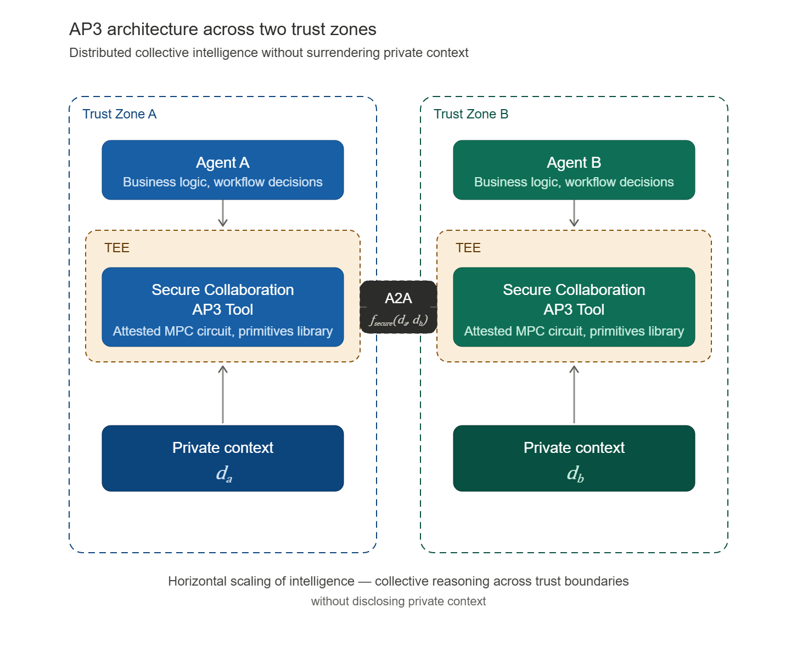
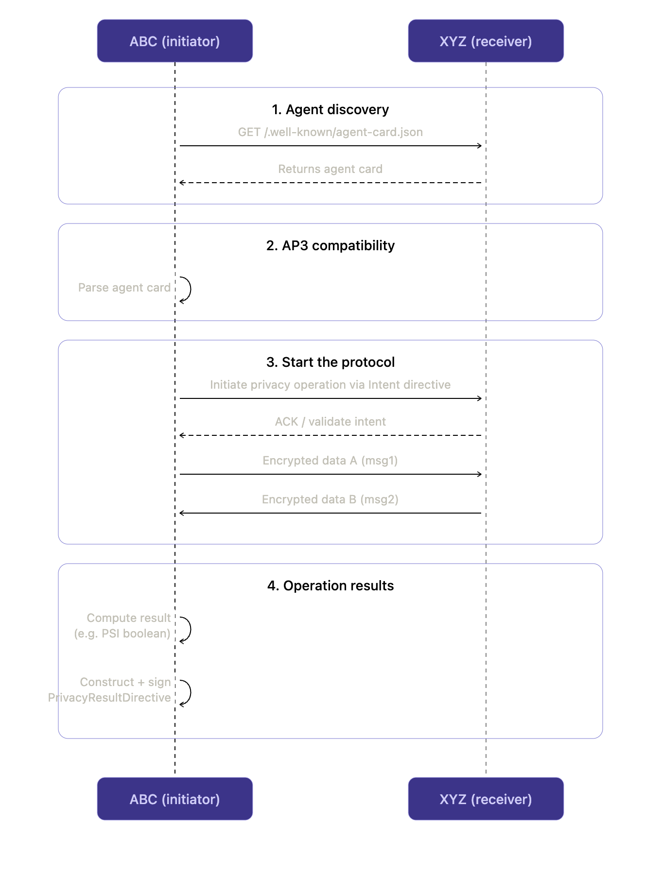

---
hide:
    - toc
---

<!-- markdownlint-disable MD041 -->
<h1><strong>Overview</strong></h1>

This page explains, from a developer's point of view, **what AP3 actually adds to your stack** and how the pieces fit together. If you've never used a privacy-preserving compute protocol before, start here.

## What problem AP3 solves

When two agents from two different organizations want to collaborate on something sensitive — "do our customer lists overlap?", "is this person on your fraud list?", "what would the joint risk score look like?" — they hit the same wall:

* **One side has data the other side wants to learn from.**
* **Neither side is willing (or legally able) to hand that data over.**
* Without a privacy lane, the only options are "share the data anyway" (privacy / regulatory risk), "share a watered-down summary" (low-quality answers), or "don't collaborate" (lost value).

AP3 adds a third option: agents *jointly compute* a function over their inputs and only the **agreed-upon result** is revealed. The raw inputs never leave their owners.

## What AP3 actually is, in one paragraph

AP3 is an open extension to the [Agent2Agent (A2A) protocol](https://a2a-protocol.org). It standardizes **how** two agents discover each other's privacy capabilities, **how** they declare what they're about to compute, **how** they exchange the cryptographic payloads required by that computation, and **what** signed artifacts they hold afterwards for audit. AP3 itself does not invent new cryptography — it provides the *messaging contract* that makes existing privacy-preserving cryptography (Secure Multi-Party Computation, Trusted Execution Environments, etc.) usable inside agent-to-agent workflows.

## The two cryptographic building blocks

AP3 composes two well-known building blocks behind a single protocol surface:

* **Secure Multi-Party Computation (SMPC).** Two or more parties jointly evaluate a function over their private inputs. Each party only learns the output it is supposed to learn — typically a minimal answer like a boolean, a score, or an intersection. Today AP3 ships [Private Set Intersection (PSI)](operations.md) on this rail.
* **Trusted Execution Environment (TEE) attestation.** A complement to SMPC for cases where the workload has to run inside a hardware enclave. The enclave produces a signed *attestation* proving "I ran this exact code on these encrypted inputs." Useful when the computation is too heavy for pure SMPC or when one party wants hardware-rooted assurance.

A given AP3 [operation](operations.md) can use either or both. The application code on top stays the same — it always sees the same AP3 surface.

## The minimal-disclosure principle

A very important property: the result returned to a calling agent is **scoped to what the workflow needs, and nothing more.** Examples:

* a boolean (e.g. "is this person on the sanctions list?")
* a bounded risk score
* a negotiated price within a range
* the cardinality of a set intersection (without the elements themselves)
* a signed compliance attestation

You should think of AP3 as *the smallest answer that's still useful*. Everything else stays inside its owner's boundary, encrypted or secret-shared.

 

{width="80%"}
{style="text-align: center; margin-bottom:1em; margin-top:1em;"}

## Core design principles

AP3 is built around four principles. When in doubt, they are the tiebreakers in design discussions:

1. **Privacy by design.** Private inputs never leave the agent that owns them in plaintext. They are either secret-shared, encrypted, or processed inside an enclave.
2. **Verifiable computation.** Results carry the metadata required to verify the computation was correct, without revealing inputs or internal state. (Real proofs are an active roadmap item — see the [Roadmap](roadmap.md) and [Private APIs](operations.md).)
3. **Interoperability.** AP3 lives as an A2A extension. Any A2A-compliant agent — built with ADK, CrewAI, LangGraph, AutoGen or anything else — can advertise and consume AP3 capabilities through the standard `AgentCard` extension surface.
4. **Composability.** Privacy operations can be combined and chained. A discovery step might use a commitment match, a computation might run PSI followed by a secure dot product, and the final receipt can be wrapped in a [W3C Verifiable Credential](w3vc-ap3.md) for downstream consumers.

## The five concepts you need to know

AP3 is built out of five small concepts. Once you understand them, the rest of the docs are reference material.

| Concept | What it is | Why it matters |
|---|---|---|
| **[Roles](roles.md)** | Who is doing what in a particular operation (e.g. *initiator* vs *receiver* in PSI). | Roles are operation-specific. They tell each side what to send, what to compute, and what they will and won't learn. |
| **[Commitments](commitments.md)** | Signed metadata describing the dataset an agent is willing to compute against — its shape, count, freshness, etc. | Lets a counterparty decide *whether* to engage **before** any private computation runs, without seeing the actual data. |
| **[Operations](operations.md)** | The concrete privacy-preserving function being computed (today: PSI). | The "verb" of AP3. Each operation has a role layout, an on-wire transcript, and a result shape. |
| **[Directives](directives.md)** | Signed envelopes that frame an operation: the `PrivacyIntentDirective` to start, the `PrivacyResultDirective` to capture the outcome. | Make the *who*, *when*, *what*, and *outcome* of a session non-repudiable and auditable. |
| **[Private APIs](operations.md)** | How privacy-preserving operations are packaged, distributed, and verified across organizations. | Two organizations interoperating on the same operation need to be able to trust the *same* implementation. This page covers reproducible builds, signing, and attestation strategies. (Today's PSI ships as pure Python; the page is forward-looking for heavier operations that will land as signed native artifacts.) |

## How a session unfolds end to end

The example below walks through the canonical AP3 flow between two agents using PSI. Replace "PSI" with any future operation and the picture stays the same — discovery, intent, rounds, result.

The setup: agent **ABC** wants to find suitable partners for a blacklist of 5,000 entries with 5 fields, and agent **XYZ** holds its own blacklist. They want to compute the intersection without exposing either list.

 

{width="80%"}
{style="text-align: center; margin-bottom:1em; margin-top:1em;"}

### Reading the diagram

1. **Discovery.** Standard A2A — fetch the receiver's Agent Card. AP3 capabilities live under the `AgentCapabilities.extensions` array; see [AP3 A2A Extension](extension.md).
2. **Compatibility check.** The initiator verifies the receiver advertises a compatible role, a matching operation (e.g. PSI), and at least one commitment whose shape it can consume. No private data has moved at this point.
3. **Protocol start.** The initiator sends a signed [`PrivacyIntentDirective`](directives.md). The receiver validates it (signature, expiry, replay nonce) and either accepts or rejects.
4. **Cryptographic rounds.** The two parties exchange operation-specific envelopes. These payloads are *encrypted or secret-shared inputs*, not the raw data. They flow inside A2A `Part.data` envelopes so they never enter the LLM prompt space. Each initiator→receiver envelope carries its own signed `PrivacyIntentDirective` so any mid-session swap is caught.
5. **Result.** In the current SDK, the **initiator** computes the final answer locally (PSI is asymmetric — only one side learns the intersection) and wraps it in a [`PrivacyResultDirective`](directives.md) for its own audit log. An optional fourth round is on the roadmap so the receiver can co-sign a result receipt for non-repudiation.

## The trust model in plain English

When you build on AP3, here is what you are and aren't trusting:

* **You trust the cryptography of the operation.** PSI is a well-studied primitive; if its preconditions hold, the receiver cannot learn the initiator's query and the initiator cannot learn anything beyond the intersection.
* **You trust the integrity of the implementation running the operation.** Today's PSI is open-source Python, so trust reduces to verifying the PyPI artifact (publisher, signature, lockfile). For future operations that ship as native code, this is what [Private APIs](operations.md) addresses — reproducible builds, multi-signature distribution, HSM/TEE attestation, and formal verification as complementary mechanisms.
* **You trust the keys advertised in `AgentCard`.** Directives and commitments are signed against those keys. Key rotation and revocation are roadmap items.
* **You do *not* have to trust the counterparty's claims about its data.** That's exactly what [commitments](commitments.md) — and, eventually, proofs of computation — exist to harden.

## Where to go next

* New to the protocol? Read [Roles](roles.md) → [Commitments](commitments.md) → [Operations](operations.md) → [Directives](directives.md) in that order.
* Wiring AP3 into an existing A2A agent? Jump to [AP3 A2A Extension](extension.md).
* Curious how AP3 evolves into commerce-grade collaboration? See the [Agentic Stack](agentic-stack.md) and the [Roadmap](roadmap.md).
