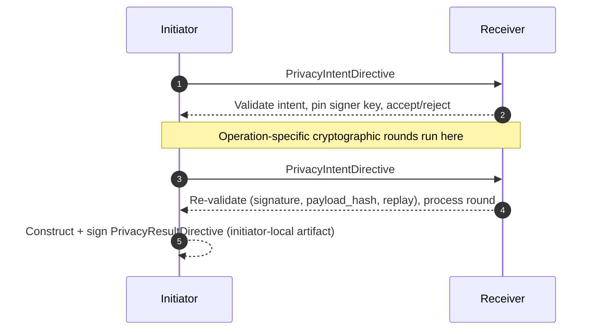

---
hide:
    - toc
---

<!-- markdownlint-disable MD041 -->
<h1><strong>Directives</strong></h1>

A **directive** is a small, signed, structured object that frames a privacy-preserving session. Think of directives as the *envelopes* of an AP3 conversation — they don't carry the cryptographic payloads themselves, but they declare what the parties intend to do, what they did, and what the result was.

There are two directives in AP3 today:

| Directive | Sent by | Purpose |
|---|---|---|
| **`PrivacyIntentDirective`** | Initiator | Opens a session. Says: *"I want to run this operation, between these participants, by this expiry."* |
| **`PrivacyResultDirective`** | Initiator (today) | Captures the outcome. Says: *"Here's the result of session X, hashed and signed."* |

Directives are how AP3 makes the **who, when, what, and outcome** of a session non-repudiable and auditable, even though the underlying data never leaves its owner.

## Why two directives, not one

The lifecycle of a privacy-preserving session has two natural checkpoints:

1. **Before any computation** — both sides need to agree on the operation, participants, expiry, and replay protection. Get this wrong (replay an old request, accept an expired one, run an operation neither side advertises) and the cryptography downstream is meaningless. That's the `PrivacyIntentDirective`.
2. **After the protocol completes** — exactly one party (in PSI, the initiator) holds the result. To prove later that this result corresponds to *this* session and not some other one, you need a signed, hash-linked artifact. That's the `PrivacyResultDirective`.

Splitting the two lets each be small, simple, and independently auditable.

## Privacy Intent Directive

The `PrivacyIntentDirective` rides on *every* outbound envelope from the initiator. Each instance binds to the payload of its own envelope via `payload_hash`, so every initiator→receiver message in a session is independently signed and tamper-evident. It looks like this:

```json
{
  "ap3_session_id": "string",
  "intent_directive_id": "string",
  "operation_type": "PSI",
  "participants": ["agent_id_1", "agent_id_2"],
  "nonce": "string",
  "payload_hash": "sha256_hex",
  "expiry": "ISO8601_timestamp",
  "signature": "string"
}
```

### Field-by-field

| Field | What it does | Why it matters |
|---|---|---|
| `ap3_session_id` | Unique identifier for this session. | Anchors all subsequent messages and the eventual result to one logical session. |
| `intent_directive_id` | Unique identifier for this directive. | Lets you reference *this exact intent* in logs and dispute resolution. |
| `operation_type` | The AP3 operation to run (today: `"PSI"`). | The receiver checks this against `supported_operations` in its own AgentCard before accepting. |
| `participants` | Agent IDs / URLs of all parties. | Receiver verifies that it actually appears in the participant list. |
| `nonce` | Initiator-chosen random value, fresh per intent. | **Replay protection.** A receiver that has seen the (intent_id, nonce, payload_hash) triple before must reject. |
| `payload_hash` | SHA-256 hex of *this envelope's* protocol payload. | Cryptographically *binds* the intent to the bytes the receiver is about to process. Any swap is caught with `INTENT_PAYLOAD_MISMATCH`. |
| `expiry` | ISO 8601 timestamp after which the directive is invalid. | Stale directives get rejected. Always set a sensible expiry (e.g. 1 hour). |
| `signature` | Base64 Ed25519 signature over the canonical directive payload. | Tamper-evidence. Verified with `PrivacyIntentDirective.verify_signature()` against the initiator's published key. |

The receiver runs full validation on the session-opening intent (signature, participants, expiry, payload binding, replay), pins the signer's pubkey, and then on every subsequent intent re-checks signature (against the pinned key), payload binding, and replay. If any check fails, it returns a `PrivacyProtocolError` (see [AP3 A2A Extension](extension.md#error-handling)) and the session is dead.

## Privacy Result Directive

The `PrivacyResultDirective` captures the outcome of a session. In the current SDK, it is a **local artifact** — see the note below.

!!! note "Current SDK behavior (AP3 over A2A)"
    In the current `ap3.a2a` implementation, the `PrivacyResultDirective` is **constructed and signed by the initiator**
    and returned to the initiator's application code after the protocol completes.

    It is **not** sent on-wire as an A2A `DataPart` today. On-wire messages are carried as `ProtocolEnvelope` objects in
    `Part.data` and contain operation-specific protocol payloads. Each initiator→receiver envelope additionally carries
    a freshly-signed `PrivacyIntentDirective` bound to that envelope's payload (see [Privacy Intent Directive](#privacy-intent-directive)).

    If you need a receiver-signed result receipt for compliance/non-repudiation, see the [potential improvement below](#potential-improvement-receiver-signed-result-receipt-optional).

### Schema

```json
{
  "ap3_session_id": "string",
  "result_directive_id": "string",
  "result_data": {
    "encoded_result": "string",
    "result_hash": "string",
    "metadata": {
      "computation_time": "string",
      "elements_found": "number"
    }
  },
  "proofs": {
    "correctness_proof": "string",
    "privacy_proof": "string",
    "verification_proof": "string"
  },
  "signature": "string"
}
```

### Field-by-field

| Field | What it does |
|---|---|
| `ap3_session_id` | The session this result belongs to. Must match the prior `PrivacyIntentDirective`. |
| `result_directive_id` | Unique identifier for this result directive. |
| `result_data.encoded_result` | The actual outcome (e.g. base64-encoded boolean for PSI). In the current SDK this is encoded, **not** encrypted — the result is something the initiator already learned. |
| `result_data.result_hash` | Hash of the result payload, used by `verify_integrity()` to confirm nothing was tampered with later. |
| `result_data.metadata` | Free-form metadata about the computation (timing, counts, query reference). |
| `proofs.*` | **Experimental placeholder fields** in the current SDK — they exist to exercise the wire format end-to-end. They are **not** real cryptographic proofs yet. Real proof generation/verification is on the [Roadmap](roadmap.md). |
| `signature` | Base64 Ed25519 signature over the canonical payload. Verified with `PrivacyResultDirective.verify_signature()`. |

### A2A `DataPart` keys

When directives *are* sent as A2A `DataPart`s, they are keyed by:

* `ap3.directives.PrivacyIntentDirective`
* `ap3.directives.PrivacyResultDirective`

Concrete `DataPart` examples are in [AP3 A2A Extension](extension.md#privacy-intent-directive-message).

## Directive exchange sequence



For developers, the practical flow is:

1. Initiator builds an intent for every outbound envelope: it sets `payload_hash` to the SHA-256 hex of that envelope's payload, calls `.sign()`, and embeds the intent alongside the payload in `Part.data`.
2. Receiver pulls the intent out, calls `validate_directive()` and `verify_signature()` on the **first** inbound envelope (and pins the signer's pubkey for the session). On every subsequent intent-bearing envelope, it re-verifies the signature against the pinned key plus the per-envelope `payload_hash` and replay key.
3. After the final cryptographic round, the initiator derives the result locally and signs a `PrivacyResultDirective` for its audit log.

## Potential improvement: receiver-signed result receipt (optional)

Some deployments want the **receiver** to send a signed *receipt* of the result for audit and compliance. For PSI specifically, the receiver does not compute or learn the final boolean result in the current protocol — the initiator does. So a naïve "receiver signs the result" round doesn't make sense as-is.

To reconcile *"receiver acknowledges a result"* with PSI's privacy goals, you can add a final attestation round on top of the existing exchange:

1. The standard PSI envelopes complete (init → msg0 → msg1 → msg2 for PSI today).
2. **A → B**: `result_claim` — initiator's claimed result + transcript hash, signed by the initiator.
3. **B → A**: receiver-signed `PrivacyResultDirective` that binds to the transcript and the claimed result (receiver attests "this result is consistent with the transcript I participated in" — *not* "this result is correct," since it never learned the result).

This gives **non-repudiation** ("receiver acknowledges result *R* for transcript *T*") without leaking the receiver's private set. Later, real proofs can be added so the receiver — or any third party — can verify correctness of the claimed result without learning private inputs. That work is tracked under [Private APIs](operations.md) and the [Roadmap](roadmap.md).
