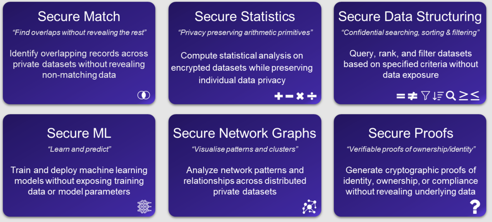

---
hide:
    - toc
---

<!-- markdownlint-disable MD041 -->
<h1><strong>What's coming</strong></h1>

[PSI](psi.md) is the first operation AP3 ships in the public SDK. The functions below are **under private preview** — the protocol surface is designed so they slot in cleanly (same role layout pattern, same wire-envelope shape, same directive flow), but they are not yet released openly. Reach out if you want early access for evaluation.

{width="75%"}
{style="text-align: center; margin-bottom:1em; margin-top:1em;"}

* **Set operations** — union, cardinality, threshold checks.
* **Private pricing and negotiation** — agreeing on a price within a range without revealing reservation prices.
* **Compliance and sanctions screening** as a first-class operation.
* **Geospatial matching** — privately checking whether two parties' regions of interest overlap.
* **Credential verification** — privately matching against issued credentials.
* **Multi-party aggregation** — sum/avg/count across N agents.
* **A DSL for user-defined private functions** so domain teams can define operations without forking the protocol.

!!! note "Operations are extensible by design"
    AP3 doesn't try to anticipate every privacy primitive. The protocol surface (roles, commitments, directives, envelope) is what's standardized; operations are the pluggable verbs on top.

For dates and protocol-level work-in-flight see the [Roadmap](../roadmap.md).
