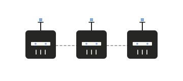
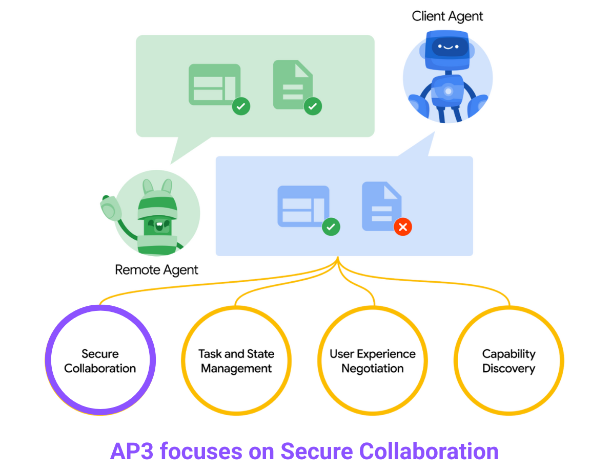

---
hide:
    - toc
---

<!-- markdownlint-disable MD041 -->
<h1 style="display: flex; align-items: center; gap: 1.25rem; margin: 1.5rem 0 2rem; flex-wrap: wrap; font-size: 1.55rem; font-weight: 400; color: #6b6b6b; line-height: 1.1; letter-spacing: -0.01em;">
  
  Agent Privacy-Preserving Protocol (AP3)
</h1>

## What is AP3?

**Agent Privacy-Preserving Protocol (AP3)** is an open protocol in research preview for privacy-preserving collaboration between autonomous agents, extending the [Agent2Agent (A2A) protocol](https://a2a-protocol.org), designed to solve a critical challenge in the emerging agentic communication: 

**How can AI agents collaborate on sensitive computations while maintaining data confidentiality and competitive advantage?**{style="color: #7e56c2;"}

Traditional agent communication requires data sharing, which creates risks:

- **Competitive Intelligence Leakage**: Proprietary algorithms, cost structures, and business strategies could be exposed
- **Regulatory Compliance Issues**: Data sharing may violate privacy regulations like GDPR and CCPA
- **Trust Barriers**: Parties are reluctant to collaborate without cryptographic privacy guarantees

AP3 addresses these challenges by providing a standardized framework for AI agents to perform privacy-preserving computation using advanced cryptographic techniques. The protocol is available as an extension for the open-source Agent2Agent (A2A) protocol, with more integrations in progress.

<!-- prettier-ignore-start -->
!!! example ""

    Build agents with
    **[{class="twemoji lg middle"} ADK](https://google.github.io/adk-docs/)**
    _(or any framework)_, equip with
    **[{class="twemoji lg middle"} MCP](https://modelcontextprotocol.io)**
    _(or any tool)_, collaborate via
    **[{class="twemoji sm middle"} A2A](https://a2a-protocol.org)**, and use
    **AP3** for secure collaboration between AI agents.
<!-- prettier-ignore-end -->

!!! note "About the acronym"
    **AP3** (pronounced "A-P-three") stands for **A**gent **P**rivacy-**P**reserving **P**rotocol, where each letter represents the first capital letter of each word: **A**gent, **P**rivacy, **P**reserving, **P**rotocol. The protocol is commonly referred to as **AP3** for brevity. 

 

{width="60%"}
{style="text-align: center; margin-bottom:1em; margin-top:1em;"}

## Try it now

Want to see AP3 in action without cloning anything? <a href="https://playground.ap3-protocol.org/" target="_blank"><strong>AP3 Playground</strong></a> runs a live <a href="./functions/psi" target="_blank">PSI flow</a> in the browser and renders an inspector view of agent cards, on-wire envelopes, signed directives, and the audit timeline.

<a href="https://playground.ap3-protocol.org/" target="_blank" class="md-button md-button--primary">Open the Playground →</a>

## How AP3 fits with neighboring standards

AP3 is intentionally narrow: it owns the **privacy-preserving compute lane**. Most real agentic workflows also need identity, credentials, payments and discovery — those are owned by other standards. AP3 is designed to compose with them, not replace them.

### AP2 and AP3

- **[AP2](https://ap2-protocol.org/)** is the payment-focused protocol in the Agent2Agent ecosystem. It facilitates settlement, value transfer, and other financial primitives between agents.
- **AP3** is a privacy-preserving collaboration protocol that lets agents jointly compute on sensitive data without revealing it.
- Use them together: AP2 handles payments, AP3 handles collaborative computation when parties need cryptographic privacy guarantees. A typical flow: AP3 produces a verifiable result (e.g. "candidate is not blacklisted"), AP2 settles the fee that the receiving agent charges for participating.

## Build with AP3

AP3 is released in its research preview, and the shape of the protocol will continue to evolve as it meets real-world use cases. We have meaningful work ahead to make it easier to adopt. But we believe AP3 represents a fundamental step forward in how privacy between AI agents should be approached — and in the ergonomics of designing cross-organizational computation into agent communication, rather than retrofitting it later.

AP3 will be continuously evolving and we actively seek your feedback and contributions to help build the future of privacy-preserving agent collaboration.

The complete technical specification, documentation, and reference implementations are hosted in our public GitHub repository.

[Visit the GitHub Repository](https://github.com/lfdt-ap3/ap3)

 You can contribute to the project by [opening an issue](https://github.com/lfdt-ap3/ap3/issues) or [submitting a pull request](https://github.com/lfdt-ap3/ap3/pulls).