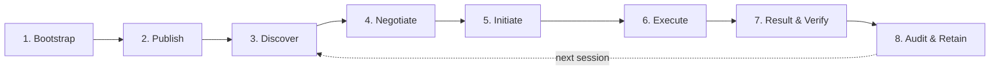

---
hide:
    - toc
---

<!-- markdownlint-disable MD041 -->
<h1><strong>Lifecycle</strong></h1>

This page is the **journey view** of AP3. It walks through every stage an agent goes through — from the moment it is built, to the moment a privacy-preserving session is signed, settled, and archived — and shows exactly **where AP3 plugs in** at each stage.

If [Architecture](architecture.md) is *what AP3 is*, and the Core Concepts pages are *each piece in detail*, this page is *how the pieces show up over time* in a real agent.

## How to read this page

The lifecycle is divided into **eight stages**. Each stage answers four questions:

1. **What's happening at this stage?**
2. **What does the agent need to do?**
3. **What part of AP3 is involved?**
4. **What artifacts get produced?**

The minimum viable AP3 deployment uses Stages 1–4 and 6 (build, publish, discover, intent, execute). 

Stages 5, 7, and 8 add negotiation, verification, and audit on top.

---

## Stage 1 — Bootstrap

**What's happening.** Before any AP3 conversation can exist, an agent has to be built and configured. This is the moment it gets its **identity** and decides which AP3 capabilities to support.

**What the agent does.**

* Generate or load a long-lived **Ed25519 signing keypair** that represents the agent's identity. This key signs commitments and directives. It should be per-agent, not per-process.
* Decide which AP3 [roles](roles.md) it can play (e.g. `ap3_initiator`, `ap3_receiver`, or both).
* Decide which AP3 [operations](operations.md) it can run (today: `PSI`).
* Wire in the AP3 SDK middleware/executor so protocol traffic stays in the structured `Part.data` lane and never enters LLM prompt space.

**Where AP3 fits.** This is configuration-only — no AP3 messages flow yet. But the choices made here determine everything downstream.

**Artifacts produced.**

* A signing keypair (private key kept locally; public key published in the AgentCard at Stage 2).
* A pre-built AP3 capability profile (roles + operations).

!!! tip "Identity vs. session keys"
    Keep a clean boundary: the **identity key** is long-lived and signs commitments/directives. **Session keys** (used inside cryptographic rounds) are ephemeral and live for one operation. Don't conflate them.

---

## Stage 2 — Publish

**What's happening.** The agent declares its AP3 capabilities to the world by publishing a standard A2A `AgentCard` enriched with the AP3 extension.

**What the agent does.**

* Build one or more [commitments](commitments.md) for the datasets it is willing to compute against — describing structure, format, count, freshness, coverage, industry, and (optionally) a `data_hash` and `expiry`.
* **Sign** each commitment with the identity key (handled by `CommitmentMetadataSystem.create_commitment()`).
* Embed the AP3 extension under `capabilities.extensions` in the AgentCard, with `roles`, `supported_operations`, and `commitments`.
* Serve the AgentCard at `/.well-known/agent-card.json`.

**Where AP3 fits.** This is the only stage where AP3 metadata is *publicly visible*. Everything later is point-to-point between the two negotiating parties.

**Artifacts produced.**

* A public AgentCard with the AP3 extension.
* A list of signed commitments embedded in the card.
* (Optional) [W3C Verifiable Credentials](w3vc-ap3.md) presented alongside the card to attest identity, regulatory status, or third-party audits of the dataset.

For the wire-level schema of the extension, see [A2A + AP3](extension.md).

---

## Stage 3 — Discover

**What's happening.** An initiator wants to find a counterparty for a privacy-preserving computation. It pulls candidate AgentCards and decides which agents are *capability-compatible*.

**What the agent does.**

* Fetch candidate `/.well-known/agent-card.json` documents (cached with TTL and key-rotation awareness).
* Parse the AP3 extension from each card.
* Compute a **compatibility score** based on:
    * **Role match.** For PSI: one party advertises `ap3_initiator`, the other `ap3_receiver`.
    * **Operation match.** Both parties list the desired operation under `supported_operations`.
    * **Commitment match.** The receiver's published commitment shape (structure, format, freshness, coverage, industry, entry count) is compatible with the initiator's needs.
* (Optional) Verify any [W3C VCs](w3vc-ap3.md) the receiver presents — e.g. proof of regulatory status, audit attestation.

**Where AP3 fits.** Discovery is **pure metadata work** — no private data has moved, no cryptographic round has run, no directive has been signed. This is critical: a poor discovery step makes everything else expensive.

**Artifacts produced.**

* A short list of candidate counterparties.
* A compatibility score per candidate.

For how this maps to compatibility scoring code, see `RemoteAgentDiscoveryService` in the SDK.

---

## Stage 4 — Negotiate (optional today, recommended for production)

**What's happening.** Before running a real session, the two parties agree on the **terms** of collaboration: which operation, which commitment, what limits, what receipts are required, what (if anything) gets paid for the work.

**What the agent does.**

* Pick the **`operation_id`** and version.
* Set **payload bounds, timeouts, retry limits** to bound resource consumption.
* Decide on **security terms**: signed-receipt requirement, proof requirement (TEE/ZK), audit-logging policy.
* (Future) Settle commercial terms via an AP2 (or x402, MPP) prepaid/postpaid quote — see [How AP3 fits with neighboring standards](index.md#how-ap3-fits-with-neighboring-standards).

**Where AP3 fits.** AP3 doesn't yet ship a standard negotiation artifact, but the engineering invariant holds: the agreed terms should be **idempotent, signed, and time-bounded**. In the current SDK, much of this is implicit (declared in AgentCards / SDK config); explicit signed negotiation artifacts are on the [Roadmap](roadmap.md).

**Artifacts produced.**

* A (logical) signed terms blob — explicit in production deployments, implicit in early integrations.

---

## Stage 5 — Initiate (Privacy Intent)

**What's happening.** The initiator opens a session and drives every outbound envelope with a freshly-signed [`PrivacyIntentDirective`](directives.md). Each intent binds to *that* envelope's payload via `payload_hash`, so every initiator→receiver message is authenticated and tamper-evident.

**What the agent does (initiator).**

* For each outbound envelope, build a `PrivacyIntentDirective` with: `ap3_session_id`, `intent_directive_id`, `operation_type`, `participants`, `nonce` (replay protection), `payload_hash` (binds the intent to *this* envelope's payload), `expiry`.
* Sign it with the identity key.
* Send the directive alongside the envelope's protocol payload under `Part.data`.

**What the agent does (receiver).**

* Pull the directive out of `Part.data`.
* On the **session-opening** envelope, run `validate_directive()`: check signature, expiry, declared participants include itself, supported operation, nonce hasn't been seen before. Pin the signer's pubkey to the session.
* On **every** subsequent envelope carrying an intent, re-validate: signature against the pinned signer, payload_hash binds the actual payload, and the intent hasn't been replayed.
* Accept (proceed to Stage 6) or reject (return a `PrivacyProtocolError`).

**Where AP3 fits.** This is the first AP3 round on the wire. Everything before was preparation; everything after is computation.

**Artifacts produced.**

* A signed `PrivacyIntentDirective` (kept by both sides for audit).
* `msg1` (transient — it's a cryptographic payload, not a long-lived artifact).

---

## Stage 6 — Execute (cryptographic rounds)

**What's happening.** The actual privacy-preserving computation runs as a fixed transcript of messages between the two parties. The exact transcript depends on the [operation](operations.md).

For PSI, the transcript is four envelopes, with a contributory `session_id = H(sid_0, sid_1)`:

| # | Direction | Phase | Payload | What happens |
|:--:|:--:|---|---|---|
| 1 | I → R | `init` | `commit(sid_0, blind)`         | Session kick-off. Initiator commits to `sid_0` under a random blind. The first signed intent rides here, authenticating the initiator. |
| 2 | R → I | `msg0` | `sid_1`                        | Receiver reveals its half of the session_id; it can't grind because `sid_0` is still hidden in the commit. |
| 3 | I → R | `msg1` | `sid_0 ‖ blind ‖ psc1`         | Initiator opens the commit, derives `session_id = H(sid_0, sid_1)`, blinds its query. A fresh signed intent on this envelope binds the actual payload. |
| 4 | R → I | `msg2` | `psc2`                         | Receiver runs its half against its private set, returns the response. |
| — | (local) | —     | result                         | Initiator processes `msg2` locally to obtain the result. |

**What the agent does.**

* Each side calls into its operation implementation (`PSIOperation.start` / `.receive` / `.process`). Most callers don't drive these directly — `PrivacyAgent.run_intent(...)` runs the whole exchange.
* All payloads ride inside A2A `Part.data` `ProtocolEnvelope` objects — never inside text messages or LLM prompt space.
* Both sides enforce idempotency: a retried round must be safe.

**Where AP3 fits.** Stage 6 is where the cryptography actually happens. AP3 standardizes the *transport and envelope* of this round-trip, not the cryptography itself — that's encapsulated by the operation implementation (a [Private API](operations.md)).

**Artifacts produced.**

* The transcript (`init` → `msg0` → `msg1` → `msg2`) — typically transient, but each initiator-side envelope's payload is bound into a signed directive so a session can be reconstructed for audit.

---

## Stage 7 — Result & Verify

**What's happening.** The session has completed. The party that's supposed to learn the result — for PSI, the **initiator** — derives it locally and packages it as a [`PrivacyResultDirective`](directives.md). Both sides then verify what they need to verify before acting on the outcome.

**What the agent does (initiator).**

* Compute the final result from the local transcript (e.g. PSI boolean / set of matches).
* Build a `PrivacyResultDirective`: `ap3_session_id` (matching the intent), `result_data.encoded_result`, `result_data.result_hash`, optional `proofs` placeholders, signature.
* Sign and store it.

**What the agent does (verifier — could be initiator, receiver, auditor, or downstream consumer).**

* Verify the **directive signatures** (intent + result) against the published identity key.
* Verify the **commitment signature** and freshness/expiry — was the receiver's claimed dataset still in scope?
* Verify any **proofs** required by the negotiated terms (TEE attestation, ZK proof, signed receiver receipt). Today these are placeholders; real proofs are on the [Roadmap](roadmap.md).
* Enforce **dedupe** and **replay** windows (the nonce in the intent must be fresh).

!!! note "Receiver-signed receipts (optional, recommended for compliance)"
    PSI's asymmetric design means the receiver doesn't compute the result itself, so it can't naïvely "sign the result". A standard pattern adds a fourth round where the receiver signs a `PrivacyResultDirective` that binds to the transcript hash plus the initiator's claimed result — providing non-repudiation without leaking the receiver's set. See [Directives → potential improvement](directives.md#potential-improvement-receiver-signed-result-receipt-optional).

**Where AP3 fits.** AP3 owns both the directive structure and (over time) the proof verification API.

**Artifacts produced.**

* A signed `PrivacyResultDirective` (initiator).
* (Optionally) a receiver-signed receipt.
* (Optionally) the result re-issued as a [W3C Verifiable Credential](w3vc-ap3.md) for downstream consumers.
* A structured **accept/reject decision** with reasons for the local audit log.

---

## Stage 8 — Audit & Retain

**What's happening.** The session is over. The agents (and their operators) need to be able to **explain what happened later** — to compliance, to auditors, to disputes — without re-running the protocol and without leaking inputs.

**What the agent does.**

* Persist signed artifacts: the intent directive, the result directive, optional receipts, the verification decision.
* Persist *minimal* metadata: counts, timings, participants, session id. **Never** persist raw inputs or transcripts.
* Tie sessions to the relevant commitment(s) by `commitment_id`.
* (Future) Feed signed-and-honored sessions into a **reputation layer** — agents that consistently honor commitments earn trust.
* (Future) On dispute or revocation, re-verify from stored artifacts and isolate the affected partner.

**Where AP3 fits.** AP3's signed-artifact-everywhere design is exactly what makes this stage cheap: every stage produces a small, canonically-serialized, signed object you can verify offline.

**Artifacts produced.**

* The agent's local audit log of AP3 sessions.
* (Future) Reputation signals derived from the log.

---

## Putting it together

The same five concepts you learn in Core Concepts show up at specific stages:

| Stage | [Roles](roles.md) | [Commitments](commitments.md) | [Operations](operations.md) | [Directives](directives.md) | [Private APIs](operations.md) |
|---|:--:|:--:|:--:|:--:|:--:|
| 1. Bootstrap | declared | — | implemented | — | linked |
| 2. Publish | published | published & signed | advertised | — | — |
| 3. Discover | matched | matched | matched | — | — |
| 4. Negotiate | — | referenced | selected | — | (proof terms) |
| 5. Initiate | — | referenced | started | **`PrivacyIntentDirective` signed** | — |
| 6. Execute | enacted | bound via `data_hash` | runs | — | runs |
| 7. Result & Verify | — | re-verified | concludes | **`PrivacyResultDirective` signed** | (proof verification, future) |
| 8. Audit & Retain | — | retained | retained | retained | retained |

If you remember one thing from this page, remember this: **AP3 produces a small, signed artifact at every stage that matters.** Discovery yields a signed AgentCard with signed commitments. Initiation yields a signed intent. Result yields a signed result directive. Each artifact is independently verifiable, time-bounded, and tied to the others by ids and hashes — which is what makes the whole lifecycle auditable without compromising privacy.

For a broader engineering view that places AP3 inside the full agentic-commerce stack (including settlement, formal proofs, and reputation), see [Agentic Stack](agentic-stack.md).
