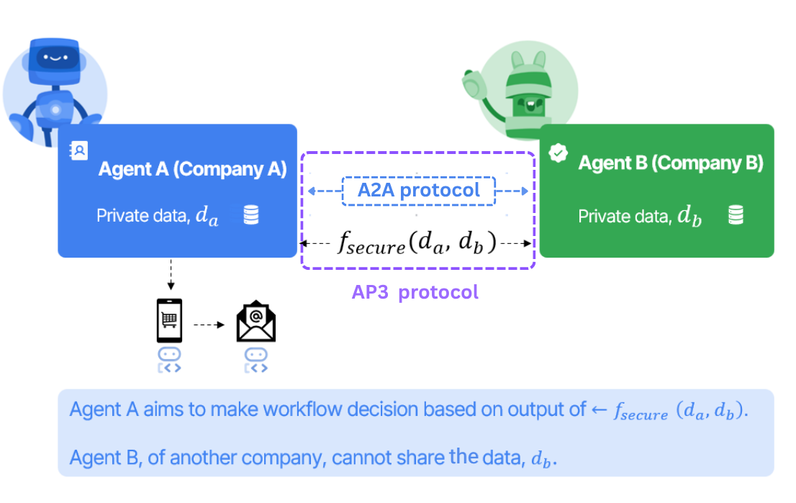

---
hide:
    - toc
---

<!-- markdownlint-disable MD041 -->
<h1><strong>Functions</strong></h1>

An **operation** is the actual *thing* two agents are computing together. If commitments declare *what data exists* and roles declare *who plays what part*, the operation is the **verb** — the privacy-preserving function being evaluated.

This page explains the mental model, walks through the operations AP3 ships today, and points to where the catalog is going.

## The mental model: secure function evaluation

Imagine a function $f$ that takes two private inputs and returns a single output:

$$ f_{\text{secure}}(d_a, d_b) \rightarrow \text{result} $$

Without AP3, you'd compute $f$ by giving both $d_a$ and $d_b$ to a single trusted server. Whoever runs that server sees both inputs in plaintext.

**With AP3, the function $f$ is evaluated jointly across both agents** without either side disclosing its input. The agents exchange cryptographic messages over the wire that look like noise to anyone in the middle, and at the end of the protocol exactly one (or both, depending on the operation) party learns *only* the result.

<br/>

{width="60%"}
{style="text-align: center; margin-bottom:1em; margin-top:1em;"}

In the diagram above:

* Agent A (left, blue) belongs to Company A and holds private dataset $d_a$.
* Agent B (right, green) belongs to Company B and holds private dataset $d_b$.
* Neither company is willing — or legally allowed — to ship its raw data outside its boundary.

Instead of moving data, AP3 invokes $f_{\text{secure}}(d_a, d_b)$ across the agents using A2A as the messaging fabric. A2A provides a vendor-neutral lane for the cryptographic payloads, so each side's authentication and access controls still apply. Only the **final, scoped output** is revealed to whichever party is supposed to learn it; everything else stays encrypted or secret-shared.

## What "operation" gives you, concretely

For developers, an operation is a four-part contract:

1. **A role layout.** Which roles are involved (e.g. `ap3_initiator` + `ap3_receiver` for PSI) and what each side is responsible for.
2. **An input schema.** What each role passes in (e.g. for PSI: a list of identifiers).
3. **A wire transcript.** A fixed sequence of envelopes carried inside A2A `Part.data` `ProtocolEnvelope`s, with strict ordering and replay protection. Operations declare their own phases (PSI uses `init` → `msg0` → `msg1` → `msg2`); the framework signs and validates each initiator→receiver envelope.
4. **A result shape.** What's returned and to whom (e.g. for PSI: a boolean / set of matches, learned only by the initiator).

Pick an operation, and these four pieces are nailed down for you. The application code on top of AP3 doesn't change as new operations are added — only the operation choice and the inputs do.

## The catalog

The functions AP3 ships today live under **Functions** in the navigation:

* **[Private Set Intersection (PSI)](functions/psi.md)** — released. Answer "is X in your set?" or "how many of mine match?" without either side disclosing its set.
* **[What's coming](functions/whats-coming.md)** — set operations, private pricing, geospatial matching, multi-party aggregation, and others, available for early evaluation.

??? info "Distribution"
    <a id="distribution"></a>

    A **Private API** in AP3 is the packaged, distributable, verifiable implementation of an operation (see above) — the shipped artifact that two parties run *byte-for-byte the same way* so they can interoperate.

    The AP3 protocol on its own says "two agents can speak PSI to each other". A Private API is the **shipped artifact that actually executes that operation** plus the trust mechanisms around it: how it's built, how it's distributed, how a counterparty verifies what's running, and (eventually) how it produces proofs that the computation was correct.

    !!! info "Today vs. tomorrow"
        **Today** the only shipped operation is **PSI**, and it lives entirely in [`ap3-functions`](https://pypi.org/project/ap3-functions/) as a pure-Python package built on [`rbcl`](https://pypi.org/project/rbcl/) (libsodium / Ristretto255) and [`merlin_transcripts`](https://pypi.org/project/merlin-transcripts/). There is no binary, no FFI, no platform-specific artifact — the wheel is `py3-none-any` and trust reduces to the PyPI artifact provenance plus the source under version control.

        The strategies below are **forward-looking** for the operations on [What's coming](functions/whats-coming.md): set operations, private pricing, geospatial matching, multi-party aggregation. Heavier protocols (especially those backed by MPC engines or zero-knowledge frameworks) will likely ship as native artifacts where the trust story is more involved. This section is the design space we'll pick from when those land.

    This page is a high-level overview. It does not lock in a single distribution model — it surveys complementary strategies, because different organizations will need different levels of assurance for different operations.

    ## Why "Private API" and not just "library"

    For a regular open-source library, the trust story is simple: you pip-install it, you trust your package manager, life moves on. Private APIs in AP3 carry stricter expectations because they sit between two organizations that don't fully trust each other:

    * **A bank** needs to know the implementation it's running is exactly the one its compliance team reviewed.
    * **A startup** can't audit cryptographic source manually but needs *some* basis for trust.
    * **An auditor** investigating a dispute needs to reconstruct what was running on both sides at the time of the session.
    * **The receiver of a result** wants assurance — eventually cryptographic, today operational — that the initiator wasn't running a tampered version that quietly leaks data.

    A Private API addresses these expectations through a layered set of mechanisms, none of which is mandatory on its own. Pick the layers that match your security posture.

    ## Design tensions

    The trust requirements for Private APIs pull in different directions:

    - **Trust** — companies don't want to use opaque black-box implementations.
    - **Security** — they need to verify the code wasn't compromised in transit or at build time.
    - **Auditability** — internal security teams want to read the source and build it themselves.
    - **Performance** — some privacy primitives are CPU-heavy; high-quality native (e.g. Rust) implementations matter for those. PSI is light enough that pure Python is fine; future operations may not be.
    - **Integration** — whatever ships must drop into AP3 agents through a stable interface.

    The strategies below are each a different balance between these tensions.

    ## Distribution strategies

    ### Strategy 1 — Open source with reproducible builds

    The lowest-friction baseline: publish complete source code under a permissive license; make builds **deterministic** so any reviewer can reproduce the published binary bit-for-bit.

    #### Benefits

    - **Full transparency** — complete source is in the open.
    - **Reproducible builds** — same inputs produce the same output, every time.
    - **Community audits** — the open-source community can review.
    - **Self-building** — companies that want maximum control can compile from source.

    #### Verification workflow

    ```bash
    # Company verification workflow
    1. Clone repository from official source
    2. Verify commit signatures
    3. Review source code
    4. Build in isolated environment
    5. Compare binary hash with published hash
    6. Run test suite
    7. Deploy to production
    ```

    This is the "bring your own paranoia" path.

    ### Strategy 2 — Multi-signature binary distribution

    Most companies don't have the bandwidth to compile every dependency from source. The next layer up: pre-built binaries co-signed by **multiple** trusted parties, so trusting any one of them is enough.

    #### Implementation sketch

    ```python
    # Binary verification system
    class BinaryVerification:
        def __init__(self):
            self.trusted_signers = [
                "privacy-protocol-consortium",
                "mozilla-foundation",
                "linux-foundation",
                "google-security-team",
            ]

        def verify_binary(self, binary_path, signatures):
            """Verify binary against multiple trusted signatures."""
            for signer in self.trusted_signers:
                if not self.verify_signature(binary_path, signatures[signer]):
                    return False
            return True
    ```

    #### Benefits

    - **Multi-party trust** — multiple independent organizations attest to the binary.
    - **Cryptographic proof** — digital signatures ensure integrity in transit.
    - **Convenience** — companies can use pre-built binaries without giving up assurance.
    - **Trust network** — leverages existing public-key trust relationships.

    ### Strategy 3 — Hardware Security Module (HSM) / TEE attestation

    When a counterparty needs *runtime* assurance — "prove that *right now* you're running the version we agreed on" — signed binaries aren't enough. Hardware-rooted attestation lets an enclave (TEE) or HSM produce a cryptographic statement about what code is loaded and what its measurement is.

    #### Implementation sketch

    ```rust
    // Rust library with HSM attestation
    #[no_mangle]
    pub extern "C" fn ppap_psi_compute(
        input_data: *const u8,
        input_size: usize,
        output_data: *mut u8,
        attestation: *mut AttestationData
    ) -> i32 {
        // Generate HSM attestation
        let attestation_data = hsm_generate_attestation();

        // Perform PSI computation
        let result = psi_compute(input_data, input_size);

        // Store attestation
        unsafe {
            *attestation = attestation_data;
            std::ptr::copy_nonoverlapping(result.as_ptr(), output_data, result.len());
        }

        0 // Success
    }

    #[repr(C)]
    pub struct AttestationData {
        pub measurement: [u8; 32],      // Code measurement
        pub signature: [u8; 64],        // HSM signature
        pub timestamp: u64,             // Attestation timestamp
        pub hsm_certificate: [u8; 512], // HSM certificate chain
    }
    ```

    #### Benefits

    - **Hardware trust** — the HSM/TEE is the root, not the operator's filesystem.
    - **Runtime verification** — assurance is per-session, not just at build time.
    - **Code integrity** — proves the code hasn't been swapped or patched in memory.
    - **Audit trail** — attestations are signed artifacts auditors can re-verify.

    ### Strategy 4 — Formal verification and certification

    For the highest-assurance deployments, the implementation is paired with **machine-checked proofs of its core properties** — using tools like Creusot, F\*, or a Coq/Lean development. The build then carries certificates from those tools.

    #### Implementation sketch

    ```rust
    // Formally verified PSI implementation
    #[cfg(feature = "formal-verification")]
    mod verified_psi {
        use creusot_contracts::*;

        #[requires(input_a.len() > 0 && input_b.len() > 0)]
        #[ensures(result.len() <= input_a.len().min(input_b.len()))]
        #[ensures(forall<i: Int> result[i] in input_a && result[i] in input_b)]
        pub fn compute_intersection(
            input_a: &[u64],
            input_b: &[u64]
        ) -> Vec<u64> {
            // Formally verified PSI implementation
            // Properties proven:
            // 1. Output is subset of both inputs
            // 2. No information leakage beyond intersection
            // 3. Correctness of intersection computation
            todo!()
        }
    }
    ```

    #### Benefits

    - **Mathematical proof** — correctness is checked, not just tested.
    - **Security guarantees** — proven invariants, not "we couldn't find a bug".
    - **Certification** — fits regulator-style and standards-body assurance models.
    - **Compliance** — meets the bar set by frameworks that require formal artifacts.

    ## Where AP3 is today (and what's experimental)

    * **Today:** the only shipped operation is PSI, implemented in pure Python in `ap3-functions` (Strategy 1 — open-source with PyPI as the distribution channel). Directives and commitments are signed; result directives expose `OperationProofs` placeholder fields that **are not real cryptographic proofs yet** (they exercise the wire format).
    * **Experimental:** real **proof of computation** — the mechanism that closes the gap between "I claim I computed honestly over the dataset I committed to" and "I can demonstrate it cryptographically". This is the long-term answer to the question "can the receiver just sign a made-up promise?". Tracked on the [Roadmap](roadmap.md) under operation-specific proof schemes (TEE/ZK).
    * **Roadmap:** native artifacts and multi-signature distribution (Strategy 2) for the heavier operations on the way, TEE attestation (Strategy 3), formal verification of the cryptographic core (Strategy 4), receiver-signed result receipts ([Directives](directives.md#potential-improvement-receiver-signed-result-receipt-optional)), key rotation/revocation semantics in discovery and verification.

    ## Security considerations

    Independent of which strategy you pick, three classes of risk always apply.

    ### 1. Supply chain security

    - **Source code review** — at least one party with the skills should review.
    - **Build verification** — reproducible builds prevent silent build-time tampering.
    - **Signature verification** — multiple trusted signatures are stronger than one.
    - **Audit trail** — keep a complete history of changes, signed.

    ### 2. Runtime security

    - **HSM / TEE attestation** — tamper-proof execution proof when the workflow demands it.
    - **Memory protection** — secure memory handling, especially for keys and shares.
    - **Input validation** — robust input sanitization at every boundary.
    - **Error handling** — secure error reporting that doesn't leak intermediate state.

    ### 3. Update security

    - **Incremental updates** — only the necessary diffs.
    - **Rollback capability** — be able to revert quickly if a release misbehaves.
    - **Update verification** — verify updates *before* installation, not after.
    - **Notification system** — alert customers about security-relevant updates.

    ## How to choose

    There is no one-size-fits-all answer. The point of layering these strategies is to let each deployment pick the level of assurance it actually needs:

    | Posture | Recommended strategies |
    |---|---|
    | Internal R&D / prototyping | Strategy 1 (build from source). |
    | Production with moderate assurance | Strategies 1 + 2 (signed binaries from a trusted publisher). |
    | Cross-org production with sensitive data | Strategies 2 + 3 (signed binaries + runtime attestation). |
    | Regulated / formal-assurance environments | Strategies 2 + 3 + 4 (signed + attested + formally verified core). |

    Companies that want full control can build from source; others can use the convenience of pre-built binaries with strong cryptographic guarantees. The key is providing **multiple trust mechanisms** so each operator picks the approach that fits its security requirements and operational constraints — and those choices compose with the rest of AP3 (commitments, directives, attestations) without forking the protocol.
