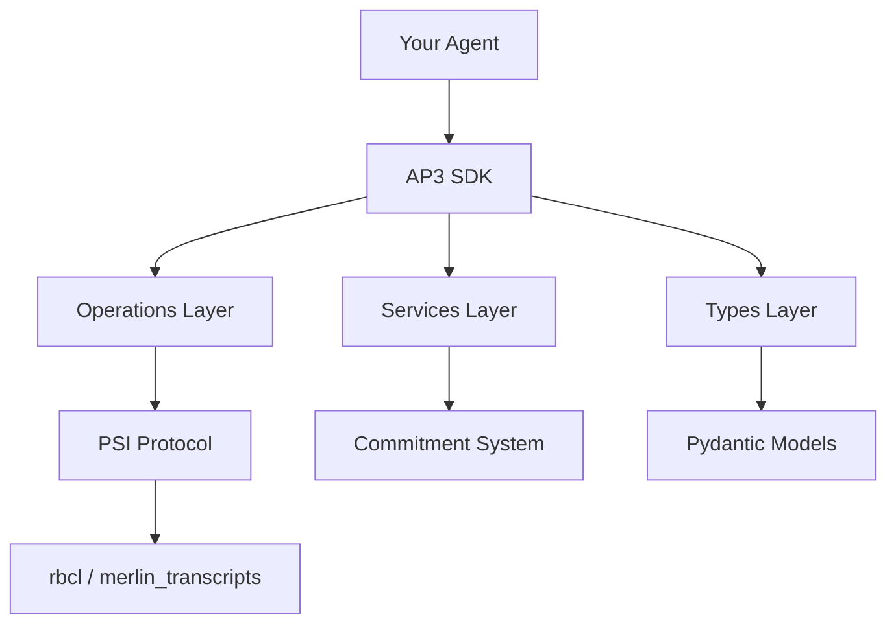

# API Reference

The AP3 SDK provides a comprehensive API for building privacy-preserving multi-agent applications.

## Core Modules

### Types
Pydantic models for commitments, directives, and protocol data structures.

- `CommitmentMetadata` - Data structure commitments
- `PrivacyIntentDirective` - Operation proposals
- `PrivacyResultDirective` - Computation results
- `DataStructure`, `DataFormat`, `DataFreshness` - Enumerations

### Operations
AP3 defines a minimal `Operation` contract in the core `ap3` package. Concrete protocol implementations live in companion packages — `ap3-functions` (installed alongside `ap3`, imported as `ap3_functions`) ships PSI today.

- `ap3.Operation` - Base class for protocol implementations (session lifecycle + wire shape)
- `ap3_functions.PSIOperation` - Private Set Intersection (PSI) sanction-check example protocol

### Services
High-level services for commitment management and discovery.

- `CommitmentMetadataSystem` - Create and manage commitments
- `CommitmentCompatibilityChecker` - Score and validate compatibility between two agents' AP3 parameters
- `RemoteAgentDiscoveryService` - Discover and check compatibility with remote agents

### Receiver-side SSRF guard (`allow_private_initiator_urls`)

Both `PrivacyAgent` (in `ap3_receiver` role) and `AP3Middleware` accept an
`allow_private_initiator_urls: bool = False` constructor flag. The default
refuses any unverified `participants[0]` URL that resolves to loopback,
RFC1918, link-local, multicast, reserved, or known cloud-metadata addresses,
surfacing `INVALID_INITIATOR_URL` *before* the unauthenticated AgentCard
fetch. See [Security → Unverified peer URLs (SSRF guard)](../security.md#unverified-peer-urls-ssrf-guard)
for the threat model and [extension → Receiver error codes](../extension.md#receiver-error-codes)
for the wire-level error.

Set `allow_private_initiator_urls=True` only in **dev/local** profiles where
peers advertise `127.0.0.1` / `localhost` card URLs to each other (the codelabs
and `examples/*` do this). Production receivers must leave it at the default.

### Custom compatibility scoring (advanced)

By default, `PrivacyAgent` / `AP3Middleware` use `CommitmentCompatibilityChecker.score_parameter_pair_compatibility(...)`
to decide whether a peer is compatible.

If you want custom business logic (e.g. prefer certain peers, tighten schema checks, add allowlists), pass a
`compatibility_scorer` callable.

Signature:

```python
def compatibility_scorer(own_params, peer_params, operation_type) -> tuple[float, str]:
    ...
```

- Return a `(score, explanation)` pair.
- The SDK treats the peer as compatible when `score >= CommitmentCompatibilityChecker.MIN_COMPAT_SCORE`.

Example:

```python
from ap3.services import CommitmentCompatibilityChecker

def strict_scorer(own, peer, operation_type):
    score, explanation = CommitmentCompatibilityChecker.score_parameter_pair_compatibility(
        own, peer, operation_type=operation_type
    )
    if score < 1.0:
        return 0.0, f"strict mode: {explanation}"
    return score, explanation
```

### Exceptions
Error handling and protocol-specific exceptions.

- `OperationError` - Base exception for operation-layer errors
- `ProtocolError` - Protocol execution errors (operations layer)

## Quick Navigation

| Module | Description | Common Use |
|--------|-------------|------------|
| `ap3.types.core` | Core data structures | Define commitments |
| `ap3.types.directive` | Privacy directives | Propose operations |
| `ap3.services` | High-level APIs | Commitment management |
| `ap3.core.operation` | Operation contract | Implement protocols |
| `ap3_functions.psi.operations` | PSI protocol implementation | Run PSI |

## Import Patterns

```python
# Types
from ap3.types.core import CommitmentMetadata, DataStructure, DataSchema, DataFormat
from ap3.types.directive import PrivacyIntentDirective, PrivacyResultDirective

# Services
from ap3.services import CommitmentMetadataSystem, CommitmentCompatibilityChecker, RemoteAgentDiscoveryService

# Operations
from ap3_functions import PSIOperation

# Exceptions
from ap3_functions.exceptions import ProtocolError
```

## Architecture



PSI is implemented in pure Python on top of `rbcl` (libsodium / Ristretto255) and `merlin_transcripts` (Fiat–Shamir).

### Commitment Creation

```python
from ap3.services import CommitmentMetadataSystem
from ap3.types.core import DataSchema, DataStructure, DataFormat

system = CommitmentMetadataSystem()
commitment = system.create_commitment(
    agent_id="agent_01",
    data_schema=DataSchema(
        structure=DataStructure.CUSTOMER_LIST,
        format=DataFormat.STRUCTURED,
        fields=["name", "id", "address"],
    ),
    entry_count=5000,
    data_hash="sha256:abc123...",  # required
)
```

## API Conventions

### Naming Patterns

- **Classes**: `PascalCase` (e.g., `PSIOperation`, `CommitmentMetadataSystem`)
- **Functions**: `snake_case` (e.g., `start()`, `receive()`, `process()`)
- **Constants**: `UPPER_SNAKE_CASE` (e.g., `DATA_STRUCTURE`)

### Return Types

- `Operation.start()`, `receive()`, `process()` return **dicts** with keys: `session_id`, `operation`, `done`, `metadata`, `outgoing`, `result`
- Services return **Pydantic models** for structured data
- Utilities return **bytes** or **primitives**

For multi-round protocols, `Operation` stores per-session state internally:

- `start(...)`: creates a new session (or uses the provided `session_id`) and calls `on_start(...)`
- `receive(...)`: responder-side entrypoint for the *first inbound message* (calls `on_process(...)` with empty state and `context.is_first_message=True`)
- `process(session_id, message, ...)`: continues an existing session (raises `KeyError` if unknown), and automatically clears session state when `done=True`

### Error Handling

PSI operations raise `ProtocolError` for invalid input, missing state, unexpected phase, or any other recoverable protocol-level failure. `OperationError` is its base class. Both subclass `Exception`.

```python
from ap3_functions.exceptions import ProtocolError
from ap3_functions import PSIOperation

psi = PSIOperation()
try:
    result = psi.start(role="initiator", inputs={"customer_data": "John Doe,ID123,123 Main St"})
except ProtocolError as e:
    print(f"Protocol failed: {e}")
```

## PSI wire shape (current `PSIOperation`)

`PSIOperation` exchanges four envelopes per session, with a contributory `session_id = H(sid_0, sid_1)` via a commit-then-reveal exchange: OB commits `sid_0` under a random blind in `init`, BB reveals `sid_1` in `msg0`, and OB opens the commit (revealing `sid_0` + `blind`) in `msg1`.

Each initiator→receiver envelope carries its own signed `PrivacyIntentDirective` bound to that envelope's payload.

| Step | Caller | Method | `outgoing` (or `result`) |
|---|---|---|---|
| 1 | Initiator (OB) | `start(role="initiator", inputs={"customer_data": "..."})` | `outgoing={"phase": "init", "message": <commit(sid_0, blind)>}` |
| 2 | Receiver (BB)  | `receive(role="receiver", message=init_msg, config={"sanction_list": [...]})` | `outgoing={"phase": "msg0", "message": <sid_1>}` |
| 3 | Initiator      | `process(session_id, message=msg0)` | `outgoing={"phase": "msg1", "message": <sid_0 ‖ blind ‖ psc_msg1>}` |
| 4 | Receiver       | `process(session_id, message=msg1)` | `outgoing={"phase": "msg2", "message": <psc_msg2>}`, `done=True` |
| 5 | Initiator      | `process(session_id, message=msg2)` | `result={"is_match": bool}`, `done=True` |

In practice most callers use `PrivacyAgent.run_intent(...)` which drives the whole exchange over A2A automatically.

## Version Compatibility

This documentation covers **AP3 SDK v1.2.x** with PSI operation `protocol.psi.sanction.v1`.


